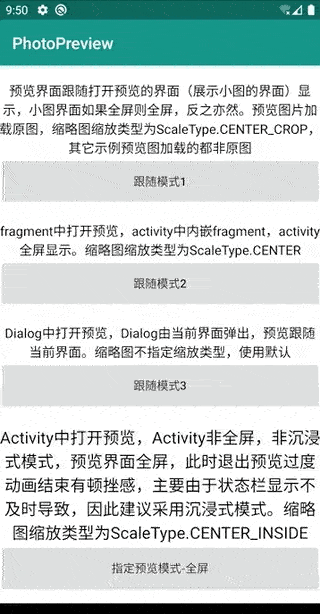

# **PhotoPreview**

仿微信朋友圈图片预览，目前仅支持图片预览

优劣势(单论只需要预览图片需求)：
 * 对于异形屏，尝试了一些github图片预览库，发现横屏状态下，缩略图与预览图过渡动画并不能无缝衔接。
 此库适配了异形屏，横屏状态下缩略图与预览图过渡动画之间无缝衔接
 * 适配了常用的使用场景，优化各种图片缩放类型下的过渡动画，提供完善的过渡动画
 * 不足之处在于，如果APP采用非沉浸式，那么打开预览的界面（Activity）如果非全屏，预览界面全屏，退出预览时，在过渡动画结束时由于要恢复Activity的状态栏，
 此时会有顿挫感。因此建议采用沉浸式模式或使用跟随模式预览图片(预览界面是否全屏看打开预览的界面是否全屏)。推荐一个实现沉浸式的库[ImmersionBar](https://github.com/gyf-dev/ImmersionBar)


[github地址](https://github.com/wanggaowan/PhotoPreview)

[国内gitee地址](https://gitee.com/wanggaowan/PhotoPreview)

[](https://www.apache.org/licenses/LICENSE-2.0.html)
[](https://jitpack.io/#wanggaowan/PhotoPreview)

建议下载[demoApk](./app-debug.apk)查看

|  |  |
| ----------------------------------------------------------------- | ------------------------------------------------------------------ |


## 引入

1. 添加 JitPack repository 到你的 build 文件

   ```groovy
    allprojects {
        repositories {
            maven { url 'https://www.jitpack.io' }
        }
    }
   ```

2. 增加依赖
   ```groovy
   dependencies {
      implementation 'com.github.wanggaowan:PhotoPreview:latest.release.here'
   }
   ```

## Usage：

预览单张照片

```java
PhotoPreview
   .with(activity)
   .sources(url)
   .imageLoader((position, source, imageView) -> {
       Glide.with(imageView.getContext())
           .load((String) source)
           .into(imageView);
   })
   .build()
   .show(thumbnailView); // 指定缩略图
```

设置全局图片加载器

```java
 PhotoPreview.setGlobalImageLoader((position, source, imageView) -> {
    Glide.with(imageView.getContext())
        .load((String) source)
        .into(imageView);
 });
```

全部配置
```java
PhotoPreview
    .with(activity) // 打开预览的界面(缩略图所处界面)
    .config(config) // 应用其它配置，以下配置覆盖此config中对应的属性
    .imageLoader(imageLoader) // 图片加载器
    .indicatorType(IndicatorType.DOT) // 图片指示器类型(目前只有圆点和文本)，预览>=2张图片时有效
    .maxIndicatorDot(9) // indicatorType为DOT时，设置DOT最大数量，如果sources数量超过此值，则改用IndicatorType.TEXT
    .selectIndicatorColor(selectColor) // 指示当前预览界面指示器颜色
    .normalIndicatorColor(normalColor) // 非当前预览界面指示器颜色
    .progressDrawable(drawable) // 图片加载loading drawable，用于imageLoader加载图片之前显示
    .progressColor(color) // 图片加载loading color, android5.0(含)之后有效
    .delayShowProgressTime(delay) // 图片加载loading延迟展示时间，<0:不展示，=0:立即显示，>0:延迟给定时间显示
    .fullScreen(true) // 是否全屏预览，如果设置为null则采用跟随模式(预览界面是否全屏显示看打开预览的界面是否全屏)
    .defaultShowPosition(0) // 默认预览的图片位置，用于多图预览
    .sources(urls) // 设置图片数据，有sources(Object...)和source(List)两个重载
    .onLongClickListener(listener) // 设置图片长按监听
    .onDismissListener(listener) // 设置预览关闭监听
    .animDuration(400) // 动画时间，null：使用默认时间，<=0: 不执行动画
    .shapeTransformType(ShapeTransformType.CIRCLE) // 图形变换类型，针对缩略图是圆形或圆角矩形
    .shapeCornerRadius(50) // 仅当图形变换类型设置为ShapeTransformType.ROUND_RECT时，指定圆角矩形圆角半径
    .openAnimDelayTime(100) // 仅建议对于低性能手机且预览动画出现卡顿时设置此值，用以提供更连贯的动画效果
    .build()
    .show(thumbnailView); // 展示预览，有show()、show(View)、show(IFindThumbnailView)三个重载
```

预览库采用一个Activity持有一个对象，因此如果需要主动关闭预览，采用如下方式即可：
```java
PhotoPreview.with(activity).build().dismiss();
```

### 使用建议：
 1. 缩略图尽量指定ImageView对象，这样有更好的过渡动画效果，更自然、顺滑
 2. 图片加载框架尽量使用Glide，由于精力有限，本库是基于Glide图片加载进行适配优化。为什么加载框架对图片预览有影响？主要是不同的加载框架，在不同图片缩放类型下提供的图片可能出现差异，而此预览库动画基于Transition库，对缩略图图片和预览大图有不少限制，否则预览动画不能无缝衔接
 3. 使用Glide加载图片时，如果需要变换，请先调用缩放变换再裁剪(其它库也参考此顺序)，因为此预览库是先缩放再裁剪，否则缩略图和预览图变换不一致，可能导致预览动画不能无缝衔接
 4. 对于低性能手机，如果缩略图控件所处嵌套太深，比如Activity嵌套Fragment，Fragment嵌套子Fragment，在子Fragment中预览图片，可能出现预览动画卡顿，此时建议设置`.openAnimDelayTime(100)`,用以提供更连贯的动画效果

### 待解决的问题(以下问题均基于Glide加载图片测试出现的问题)：
1. 缩略图缩放类型为ScaleType.MATRIX时，如果不指定`.shapeTransformType(type)`,则过度动画打开和关闭可能都无法无缝衔接，指定后其实也是调整为其它缩放模式，因此缩略图尽量不使用ScaleType.MATRIX缩放类型
2. 指定缩略图变换类型为`.shapeTransformType(ShapeTransformType.CIRCLE)`时，如果缩略图宽高不相等，那么指定缩列图缩放类型为ScaleType.FIT_XY、ScaleType.CENTER_CROP后，预览动画不能无缝衔接，因此需要切圆的缩列图，尽量保证控件宽高一致或使用其它缩放类型


## **感谢**

此库灵感来源 [PhotoViewer](https://github.com/wanglu1209/PhotoViewer)

动画优化参考 [XPopup](https://github.com/li-xiaojun/XPopup)


## **Proguard**

无需添加任何混淆规则，可直接混淆

## ***License***

PhotoPreview is released under the Apache 2.0 license.

```TEXT
Copyright 2019 wanggaowan.

Licensed under the Apache License, Version 2.0 (the "License");
you may not use this file except in compliance with the License.
You may obtain a copy of the License at

    http://www.apache.org/licenses/LICENSE-2.0

Unless required by applicable law or agreed to in writing, software
distributed under the License is distributed on an "AS IS" BASIS,
WITHOUT WARRANTIES OR CONDITIONS OF ANY KIND, either express or implied.
See the License for the specific language governing permissions and
limitations under the License.
```
