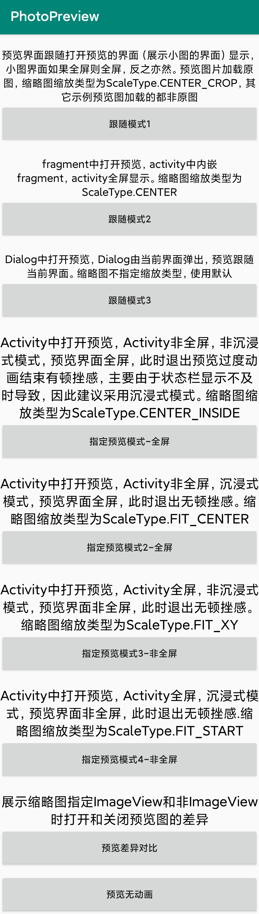

# **PhotoPreview**

仿微信朋友圈图片预览，目前仅支持图片预览

优劣势(单论只需要预览图片需求)：
 * 对于异形屏，尝试了很多github图片预览库，发现横屏状态下，缩略图与预览图过度动画并不能无缝衔接。
 此库适配了异形屏，横屏状态下缩略图与预览图过度动画之间无缝衔接
 * 不足之处在于，如果APP采用非沉浸式，那么打开预览的界面（Activity）如果非全屏，预览界面全屏，那么退出预览时，在过度动画结束时由于要恢复Activity的状态栏，此时会有顿挫感。因此建议采用沉浸式模式或使用跟随模式预览图片(预览界面是否全屏看打开预览的界面是否全屏)。推荐一个实现沉浸式的库[ImmersionBar](https://github.com/gyf-dev/ImmersionBar)


[项目 github 地址](https://github.com/wanggaowan/PhotoPreview)

[](https://www.apache.org/licenses/LICENSE-2.0.html)
[](https://jitpack.io/#wanggaowan/PhotoPreview)

不会弄gif，建议下载[demoApk](./app-debug.apk)查看



<!-- {:height="960px" width="540px"} -->

#### 引入

1. 添加 JitPack repository 到你的 build 文件

   ```groovy
    allprojects {
        repositories {
            maven { url 'https://www.jitpack.io' }
        }
    }
   ```

2. 增加依赖
   ```groovy
   dependencies {
      implementation 'com.github.wanggaowan:PhotoPreview:latest.release'
   }
   ```

# Usage：

预览单张照片

```java
PhotoPreview
   .with(MainActivity.this)
   .sources(url)
   .imageLoader((position, source, imageView) -> {
       Glide.with(imageView.getContext())
           .load((String) source)
           .into(imageView);
   })
   .build()
   .show(thumbnailView); // 指定缩略图
```

设置全局图片加载器

```java
 PhotoPreview.setGlobalImageLoader((position, source, imageView) -> {
    Glide.with(imageView.getContext())
        .load((String) source)
        .into(imageView);
 });
```
上面加载可简写为

```java
PhotoPreview
   .with(MainActivity.this)
   .sources(url)
   .build()
   .show(thumbnailView); // 指定缩略图
```

全部配置
```java
PhotoPreview
    .with(activity) // 打开预览的界面
    .imageLoader(imageLoader) // 图片加载器
    .indicatorType(IndicatorType.DOT) // 图片指示器类型(目前只有圆和文本)，预览>=2张图片时有效
    .selectIndicatorColor(selectColor) // 指示当前预览界面指示器颜色
    .normalIndicatorColor(normalColor) // 非当前预览界面指示器颜色
    .progressDrawable(drawable) // 图片加载loading drawable，用imageLoader之前显示
    .progressColor(color) // 图片加载loading color, android5.0(含)之后有效
    .delayShowProgressTime(delay) // 图片加载loading延迟展示时间，<0:不展示，=0:立即显示，>0:延迟给定时间显示
    .fullScreen(true) // 是否全屏预览，如果设置为null则采用跟随模式(预界面是否全屏看打开预览的界面是否全屏)
    .defaultShowPosition(0) // 默认预览的图片位置，用于多图预览
    .sources(urls) // 设置图片数据，有sources(Object...)和source(List)两个重载
    .onLongClickListener(listener) // 设置图片长按监听
    .onDismissListener(listener) // 设置预览关闭监听
    .build()
    .show(thumbnailView); // 展示预览，有show()、show(View)、show(IFindThumbnailView)三个重载
```

预览库采用一个Activity持有一个对象，因此如果需要关闭预览，可以不用单独记录PhotoPreview对象,在同一个Activity中，采用如下方式即可
```java
PhotoPreview.with(this).build().dismiss();
```


此库参考 [PhotoViewer](https://github.com/wanglu1209/PhotoViewer)，并在此基础上做了修改，修复内存泄漏问题，优化动画,现在打开关闭更加流畅。

#### **Proguard**

无需添加任何混淆规则，可直接混淆

#### ***License***

PhotoPreview is released under the Apache 2.0 license.

```TEXT
Copyright 2019 wanggaowan.

Licensed under the Apache License, Version 2.0 (the "License");
you may not use this file except in compliance with the License.
You may obtain a copy of the License at

    http://www.apache.org/licenses/LICENSE-2.0

Unless required by applicable law or agreed to in writing, software
distributed under the License is distributed on an "AS IS" BASIS,
WITHOUT WARRANTIES OR CONDITIONS OF ANY KIND, either express or implied.
See the License for the specific language governing permissions and
limitations under the License.
```
